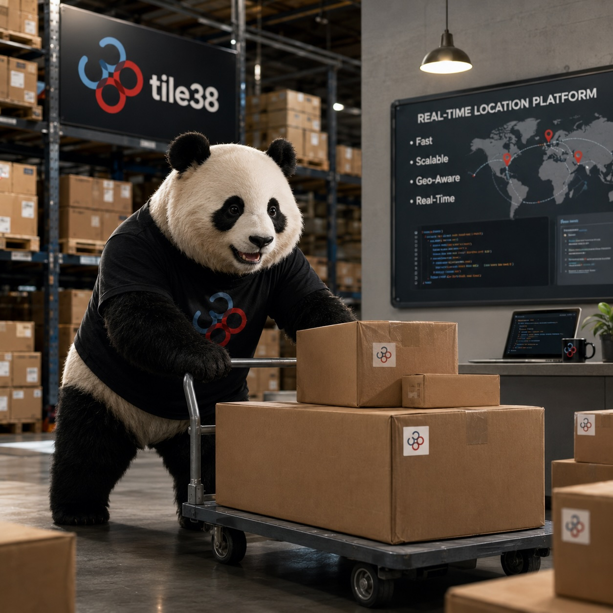

<h1 align="center">Tile38 Helm Chart</h1>

<p align="center">
  
</p>

<p align="center">
  
  
  <a href="https://artifacthub.io/packages/search?repo=tile38"></a>
</p>

## Introduction

Tile38 is an ultra-fast, in-memory geospatial database with native geofencing capabilities. It is designed for real-time location-based applications and supports complex spatial queries with very low latency.

This Helm chart deploys Tile38 on Kubernetes and supports a **leader–follower architecture** to enable horizontal read scaling while keeping write consistency.

### Architecture Overview

The chart deploys Tile38 using a **single leader** and **zero or more followers**:

- **Leader** (`Deployment` + optional `PVC`)
  - Handles all write operations
  - Acts as the source of truth
  - Optionally persists data using a PersistentVolumeClaim

- **Followers** (`StatefulSet` when persistence is enabled, otherwise `Deployment`)
  - Replicate data from the leader via Tile38's native `FOLLOW`
  - Serve read-only traffic for horizontal read scaling
  - Optional `PodDisruptionBudget` to protect read availability during voluntary disruptions

## Prerequisites

- Kubernetes **1.21+** (PDB v1, seccompProfile.RuntimeDefault)
- Helm **3.8+**
- A working PersistentVolume provisioner (if persistence is enabled)
- Prometheus Operator (only if `serviceMonitor.enabled=true`)

---

## Installation and Quick Start

```bash
helm repo add tile38 https://1995parham.github.io/tile38-chart
helm repo update
helm install tile38 tile38/tile38
```

### Post-installation

After installation, Helm prints connection instructions in the output of `NOTES.txt`.

Example port-forwarding:

```bash
kubectl port-forward svc/tile38-leader 9851:9851
```

You can then connect using:

```bash
tile38-cli -p 9851 ping
```

---

## Configuration

Configuration values follow the structure of `values.yaml`. Below are the highlights — see `values.yaml` for the full surface, and `values.schema.json` for client-side validation.

### Image

| Name                          | Description                            | Default         |
|-------------------------------|----------------------------------------|-----------------|
| `image.repository`            | Tile38 image repository                | `tile38/tile38` |
| `image.tag`                   | Image tag (defaults to `appVersion`)   | `""`            |
| `image.pullPolicy`            | Image pull policy                      | `IfNotPresent`  |
| `initContainerImage.repository` | Init container that seeds the config | `busybox`       |
| `initContainerImage.tag`      | Init container tag                     | `1.36`          |

### Leader

| Name                                       | Description                              | Default       |
|--------------------------------------------|------------------------------------------|---------------|
| `leader.replicaCount`                      | Fixed at 1 (Tile38 has no multi-leader)  | `1`           |
| `leader.rolloutStrategy`                   | Deployment `strategy`                    | `{}`          |
| `leader.revisionHistoryLimit`              | ReplicaSets kept for rollback            | `10`          |
| `leader.terminationGracePeriodSeconds`     | Graceful shutdown window                 | `30`          |
| `leader.priorityClassName`                 | Pod `priorityClassName`                  | `""`          |
| `leader.topologySpreadConstraints`         | Spread constraints                       | `[]`          |
| `leader.podSecurityContext`                | Override `global.podSecurityContext`     | `{}`          |
| `leader.securityContext`                   | Override `global.securityContext`        | `{}`          |
| `leader.nodeSelector` / `tolerations` / `affinity` | Override `global.*` scheduling   | `{}` / `[]` / `{}` |
| `leader.config.enabled`                    | Mount a ConfigMap-backed config file     | `true`        |
| `leader.config.configs`                    | Tile38 config (kebab-case keys)          | `{ protected-mode: "no" }` |
| `leader.service.type`                      | Service type                             | `ClusterIP`   |
| `leader.service.tilePort`                  | Tile38 client port                       | `9851`        |
| `leader.service.monitoringPort`            | Prometheus port (when SM enabled)        | `4321`        |
| `leader.persistence.enabled`               | Use a PVC for `/data`                    | `true`        |
| `leader.persistence.size`                  | PVC size                                 | `10Gi`        |
| `leader.persistence.storageClassName`      | StorageClass                             | `""`          |
| `leader.persistence.existingClaim`         | Bind an existing PVC                     | `""`          |
| `leader.persistence.keepOnDelete`          | Add `helm.sh/resource-policy: keep`      | `true`        |
| `leader.livenessProbe.*` / `readinessProbe.*` / `startupProbe.*` | TCP probes on `tile` port | configurable |
| `leader.resources`                         | Requests / limits                        | `100m / 128Mi` |
| `leader.extraArgs` / `extraFlags`          | Extra `tile38-server` args / flags       | `{}` / `[]`   |

### Followers

| Name                                          | Description                              | Default       |
|-----------------------------------------------|------------------------------------------|---------------|
| `followers.enabled`                           | Deploy followers                         | `true`        |
| `followers.replicaCount`                      | Number of follower replicas              | `2`           |
| `followers.config.configs.follow_host`        | Leader host (auto-defaults)              | `""`          |
| `followers.config.configs.follow_port`        | Leader port                              | `9851`        |
| `followers.config.configs.leaderauth`         | Inline leader password (avoid in prod)   | `""`          |
| `followers.config.configs.read_only`          | Enable read-only mode                    | `true`        |
| `followers.config.existingSecret`             | Secret name holding `leaderauth`         | `""`          |
| `followers.config.existingSecretKey`          | Key inside the Secret                    | `leaderauth`  |
| `followers.service.type`                      | Service type                             | `ClusterIP`   |
| `followers.service.headless`                  | Also create a headless Service for DNS   | `false`       |
| `followers.persistence.enabled`               | StatefulSet + `volumeClaimTemplates`     | `true`        |
| `followers.persistence.size`                  | PVC size per replica                     | `10Gi`        |
| `followers.pdb.enabled`                       | Render a PodDisruptionBudget             | `false`       |
| `followers.pdb.minAvailable` / `maxUnavailable` | PDB constraint                         | `""` / `1`    |
| `followers.livenessProbe.*` / `readinessProbe.*` / `startupProbe.*` | TCP probes      | configurable |

### Global

| Name                        | Description                                          | Default                              |
|-----------------------------|------------------------------------------------------|--------------------------------------|
| `global.podSecurityContext` | Pod-level security context (inherited per component) | `runAsNonRoot, fsGroup, seccompProfile` |
| `global.securityContext`    | Container security context (inherited per component) | `dropAll, noPrivEsc, runAsNonRoot`   |
| `global.podAnnotations`     | Pod annotations                                      | `{}`                                 |
| `global.podLabels`          | Pod labels                                           | `{}`                                 |
| `global.imagePullSecrets`   | Image pull secrets                                   | `[]`                                 |
| `global.nodeSelector`       | Default node selector                                | `{}`                                 |
| `global.tolerations`        | Default tolerations                                  | `[]`                                 |
| `global.affinity`           | Default affinity                                     | `{}`                                 |

### ServiceAccount

| Name                         | Description                                | Default |
|------------------------------|--------------------------------------------|---------|
| `serviceAccount.create`      | Create ServiceAccount                      | `true`  |
| `serviceAccount.automount`   | Mount API token into pods                  | `false` |
| `serviceAccount.annotations` | ServiceAccount annotations (e.g. IRSA ARN) | `{}`    |
| `serviceAccount.name`        | Custom ServiceAccount name                 | `""`    |

### Monitoring

| Name                            | Description                | Default |
|---------------------------------|----------------------------|---------|
| `serviceMonitor.enabled`        | Render a ServiceMonitor    | `false` |
| `serviceMonitor.interval`       | Scrape interval            | `30s`   |
| `serviceMonitor.scrapeTimeout`  | Scrape timeout             | `10s`   |
| `serviceMonitor.labels`         | Extra labels on SM         | `{}`    |

> Requires Prometheus Operator. When `serviceMonitor.enabled=true` the chart
> also adds `--metrics-addr` to Tile38 so it exposes Prometheus metrics on
> `monitoringPort`.

### Network Policy

| Name                    | Description             | Default                       |
|-------------------------|-------------------------|-------------------------------|
| `networkPolicy.enabled` | Render a NetworkPolicy  | `false`                       |
| `networkPolicy.from`    | Allowed ingress sources | `[{ podSelector: {} }]`       |

---

## Operational Guidance

### Leader authentication via Secret

```yaml
followers:
  config:
    existingSecret: tile38-leader-credentials
    existingSecretKey: password
```

The follower init container reads the password from the referenced Secret
and templates it into `/data/config` at startup, keeping the value out of
the ConfigMap and out of plain `git` diffs.

### Persistence

- **Leader** uses a single PVC when persistence is enabled
- **Followers** use StatefulSet `volumeClaimTemplates`, creating one PVC per replica
- `keepOnDelete: true` annotates PVCs with `helm.sh/resource-policy: keep` so they survive `helm uninstall`

### Pod Disruption Budget

Recommended in production to keep at least one follower available during
node drains:

```yaml
followers:
  pdb:
    enabled: true
    minAvailable: 1
```

### Verification

```bash
helm test tile38
```

Built-in tests:

- Leader connectivity (`PING`)
- Leader `SET`/`GET`
- Geospatial round-trip
- Follower replication (polled for up to 30s)

### Uninstalling

```bash
helm uninstall tile38
```

> PersistentVolumeClaims are retained when `keepOnDelete=true`. Delete them
> manually if you want a full cleanup.

---

## License

This chart is licensed under the Apache 2.0 License.
